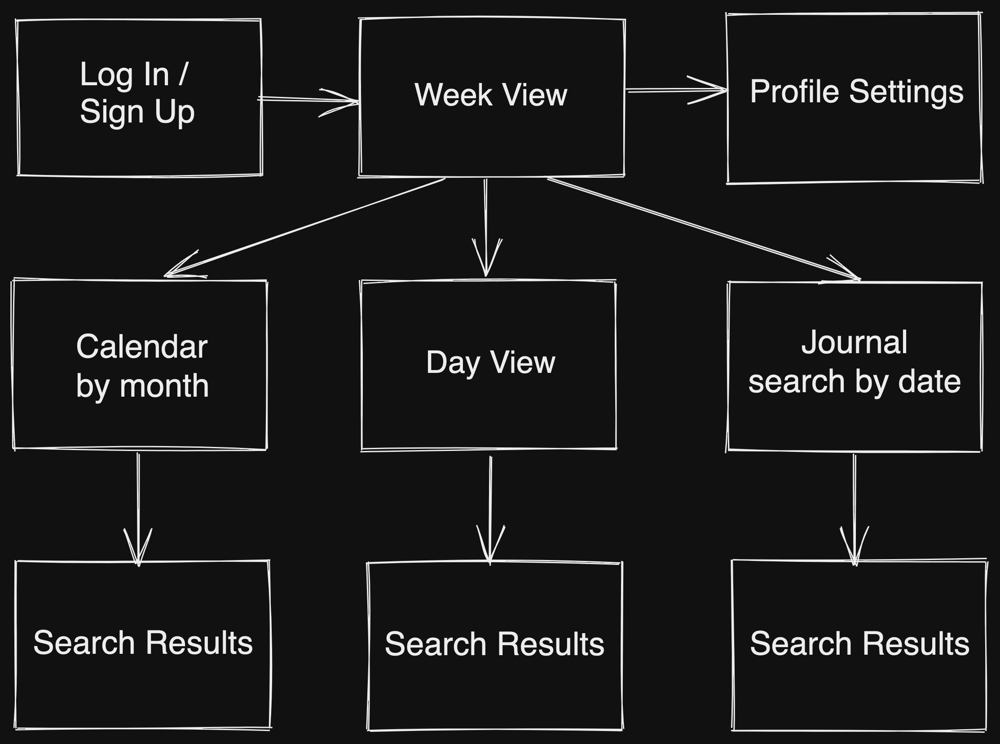

# Lunar Task
### Final PERN project for Techtonica.  
**Lunar Task** is a task management app with lunar cycle integration and journaling capabilities.  
I'm building it because I like to track my tasks and divide them between the days of the week. I also like to plan according to the moon phases and the spiritual meaning they carry. Lastly, it would be good to have a journal feature to track how I felt about each day and to reflect on the past weeks/years.  
## Technology. 
- I will use React, Bootstrap, and Beautiful DnD to build the UI
- the backend API will be PEN Postgres/Express/Node
- It will also be integrated with an external moon phase API and an external database for moon phase intentions
## MVP (Minimum Viable Product)
- User registration/Login
- Calendar/Week/Day view with the ability to add tasks
- Moon phase for each day with a blurb about the intentions for the day
## Additional Nice-to-Have Features
- Auth0 for login/registration
- Drag and Drop functionality
- Adding journal entries for the day
## Technical Risks
- React Beatifull DnD might be too complicated to integrate
  - *In that case, I will just have simple edit day functionality*
- Auth0 for login/registration might have issues with authentification
  - *I will add simplified ability to register and login and store it in a separate table in my database*
## User Flow

## Wireframes
### Mobile Login

### Mobile Sign up

### Mobile Wireframes

### Desktop Wireframes

## Data Model
Tasks  | Journal
------------- | -------------
id - primary key | id - primary key
text - varchar | text - varchar
date - datetime | date - datetime
user_id - foreign key  | user_id - foreign key 

## Installation & Technology Requirements

### Docker

This project relies on Docker to run the PostgreSQL server. You must install Docker first before continuing.

Use one of these methods:

- Use [Homebrew][] on macOS: `brew install docker`
- [Follow the instructions on the Docker website][docker-www]

### Node

You'll need to install Node v14 or above. [`nvm`][nvm] is highly recommended.

## Set Up the Development Environment

### Install NPM Packages

```sh
npm install
```

### Set Up `postgres` User Password and Database Name

We need to set up couple pieces of information in order to start a new
PostgreSQL server instance, as well as to connect to it later from the Express
server.

1. Copy the example environment file

   ```sh
   cp .env.example .env
   ```

2. You can choose to edit `.env` or just use as-is.

[See the PostgreSQL Docker image documentation for more
information][dh-postgres].

### Initialize the Database

Let's set up the database server, create the application database, and seed it
with some data. You only need to do this the first time you set up your
development environment.

```sh
npm run db:init
```

ℹ️ If you ever need to start over with the database, you can run this command
again which will delete your existing data and start from scratch.

## Start the Development Environment

```sh
npm start
```

Visit <http://localhost:3000>.

## Shut Down the Development Environment

1. `Ctrl-C` to stop the Express and React development servers.
1. `npm run db:stop` to stop and destroy the PostgreSQL Docker container. Don't
   worry, your data is safe.

## Need to Start a `psql` Session?

```sh
npm run psql
```
## Deployment

[Read about setting up and deploying to Heroku](docs/deployment.md)\
[dh-postgres](https://hub.docker.com/_/postgres)\
[docker-www](https://docs.docker.com/get-docker/)\
[george's setup](https://github.com/gsong/express-react-project-example)\
[homebrew](https://brew.sh)\
[live](https://lunar-task.herokuapp.com/)\
[nvm](https://github.com/nvm-sh/nvm)
